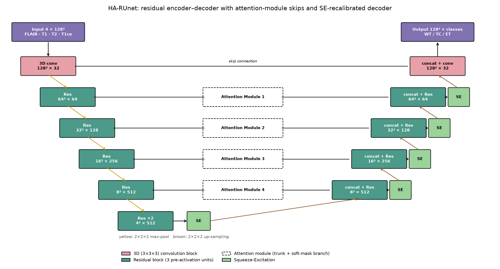

# HA-RUnet: Hybrid Attention Residual 3D U-Net for Brain Tumor Segmentation

A lightweight 3D U-Net for volumetric brain tumor segmentation on MRI (input 4 × 128³: FLAIR, T1, T2, T1ce).

- **Residual blocks**: identity mapping + three pre-activation BN → ReLU → Conv units (bottleneck), in the
  encoder (32 → 512 channels, 2×2×2 max-pooling, 4³ × 512 bottleneck) and decoder.
- **Attention Modules 1–4** on the skip connections at 64³, 32³, 16³ and 8³: a *trunk branch* (two residual
  blocks) is multiplied by a *soft mask* from an encoder–decoder branch, combined as (1 + M) · T.
- **Squeeze-Excitation** after every decoder stage (and the bottleneck) re-weights channels using global context.



## Highlights
- Dice **0.867 / 0.813 / 0.787** (Whole Tumor / Tumor Core / Enhancing Tumor) on BraTS-2020
- Sensitivity **0.93 / 0.88 / 0.83**
- Outperforms ResUNet and AResUNet with fewer parameters

## Repository Structure
```
HA-RUnet/
├── Code/
│   ├── model.py              # HA-RUnet: residual blocks, attention modules, SE; ablation switches
│   ├── dataset.py            # BraTS-2020 loader (WT / TC / ET region masks)
│   ├── losses.py             # Dice + BCE loss, Dice & sensitivity metrics
│   ├── train.py              # training loop (AdamW, cosine LR, mixed precision)
│   ├── evaluate.py           # Dice / sensitivity on a trained checkpoint
│   ├── plot_architecture.py  # renders Figures/architecture.png
│   ├── plot_history.py       # training curves from history.json
│   └── requirements.txt
├── Dataset/                  # BraTS-2020 download instructions
├── Figures/                  # architecture diagram, training curves
├── Results/                  # published metrics, reproduced runs
├── LICENSE
└── README.md
```

## Quick Start
```bash
cd Code
pip install -r requirements.txt
python model.py                                   # parameter counts (ablations) + shape check
python train.py --data ... --no-attention --no-se  # ablation: residual U-Net baseline
python train.py --data ../Dataset/MICCAI_BraTS2020_TrainingData
python evaluate.py --data ../Dataset/MICCAI_BraTS2020_TrainingData --checkpoint ../Results/run/best_model.pt
```

## Publication
**A Hybrid Attention-Based Residual Unet for Semantic Segmentation of Brain Tumor**  
*Computers, Materials & Continua (CMC)*, vol. 76, no. 1, 2023.  
[Paper](https://www.techscience.com/cmc/v76n1/53090) · [ScienceDirect](https://www.sciencedirect.com/org/science/article/pii/S1546221823002084)

## Author
**Wajiha Rahim Khan**  
[Google Scholar](https://scholar.google.com/citations?user=ctvOkbYAAAAJ) · [Email](mailto:wajihakhan906@gmail.com)

## License
MIT. See [LICENSE](LICENSE).
